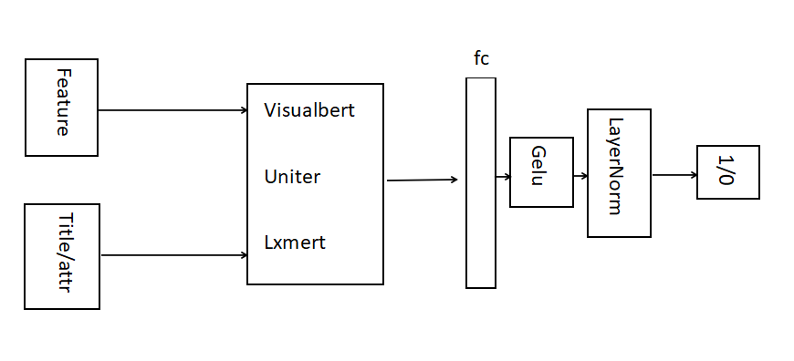

# 代码说明

## 环境配置

使用了自定义镜像：just复现镜像

python==3.8.5

boto3==1.21.23

botocore==1.24.23

jieba==0.42.1

numpy==1.21.4

pandas==1.3.4

scipy==1.7.2

torch==1.7.1

tqdm==4.62.3

transformers==3.5.1

tokenizers==0.9.3

torchaudio==0.7.2

torchvision==0.8.2

## 数据

本项目中未使用除官方给定的数据外的其他数据

## 预训练模型

chinese-roberta-wwm-ext:

项目地址：https://github.com/ymcui/Chinese-BERT-wwm

下载地址：https://drive.google.com/file/d/1eHM3l4fMo6DsQYGmey7UZGiTmQquHw25/view

rbt6:

项目及下载地址：https://huggingface.co/hfl/rbt6/tree/main

## 算法

### 整体思路介绍

我们的算法模型是将整个图文匹配看成属性匹配和标题匹配两个任务，分别构造了五个模型。其中三个模型为混合模型将属性和标题数据集进行混合输入到同一个模型中，最后输出一个维度判断匹配还是不匹配，这三个模型分别为visualbert、uniter和一个六层的visualbert。另外为了对齐标题中的文本属性和图片中属性，我们调整了visualbert模型结构，构造了两个只用于title和图片匹配的模型。

### 方法创新点

1. 修改了visualbert，uniter模型的输入结构和输出结构，使得这两个个依赖目标检测模型提取特征的多模态匹配模型适用于本任务。输入结构主要是调整图片feature的shape，输出结构主要是在每个模型的最后一层连接了两个全连接层，全连接层之间使用gelu和LayerNorm进行连接，最后一个全连接层的维度为1，用于输出匹配还是不匹配。
2. 对于我们算法中最主要的单模型visualbert模型进行了结构的改进，对于标题匹配任务，在模型的第一层增加了4通道的1x1的卷积层，用于提升输入图片feature的通道数，可以起到对原始图片进行属性特征提取的作用，可以实现细粒度的图文匹配。

### 网络结构



### 损失函数

损失函数使用了BCEWithLogitsLoss。

### 数据扩增

数据扩增分为正样本扩增和负样本扩增，样本扩增都是使用在线扩增，每个epoch正负样本扩增都保持接近1:1的比例。

正样本扩增方法：以百分之五十的概率打乱文本的顺序（但保持文本中的属性词不被打乱）；以百分之五十的概率对文本中相等属性进行替换。

负样本扩增方法：对正样本以百分之五十的概率生成负样本，对文本的每个属性也以百分之五十的概率替换为不等的属性（替换的属性是同一类别下的）；以百分之五十的概率对文本中的相等属性进行替换。

### 模型集成

五个模型中可以用于title和图片匹配的模型有五个，预测时每个模型阀值设为0.5，大于0.5则匹配小于0.5则不配。单模型预测完后进行投票大于等于3个为匹配否则不匹配。五个模型中可以用于属性和图片匹配的模型一共有三个，预测每个属性阀值一般为0.5（训练集中该种属性个数少于200除外，该种类型属性单独调低了阀值），单模型预测完后进行投票大于等于2个为匹配否则不匹配。另外由于用于title匹配的模型比属性匹配的模型多，我们对实验结果进行了后处理，如果title和图片匹配，则所有属性匹配。

### 算法其他细节

我们对数据进行了预处理，考虑到一般图片中不能反映年份信息，所以对title中的年份信息进行删除。

## 训练流程

训练命令：

```
sh train.sh
```

1. title-image任务中对每个样本以json格式进行重新存储,得到新的title数据集，attribute-imge任务中对每个title进行属性抽取得到新的attr数据集。
2. 划分训练集和测试集，特别的对visulbert模型划分10fold数据集。
3. 训练每一个title模型。
3. 加载title训练完的模型作为attr预训练模型，然后接着训练attr模型。（其中visualbert模型的title和attr模型结构不一样，需要单独训练一个结构和attr结构一样的title模型作为预训练模型，该模型在data路径下名为best_moel_visualbert_title_c5.pth，train.sh不再单独进行训练该模型）

更加详细的信息见train.sh

## 测试流程

测试命令：

```
sh test.sh data/contest_data/preliminary_testB.txt
```

1. 使用多个title-image模型和多个attribute-image模型进行测试集的预测。

2. 集成不同模型结果并且合并title-image和attribute-image的结果得到最终的结果。

更加详细的信息见test.sh

## 其他注意事项

训练集和验证集以9:1的比例进行划分，特别的是，以负样本的样本数为依据来进行比例划分。例如在给定的数据集中负样本有1万条而正样本有十几万条，所以我们的验证集是负样本1000条和正样本1000条，其余作为训练集。

## 成绩

本次比赛决赛受疫情影响，延期举行，初赛中我们团队（just）获得第三名，复赛获得第四名


